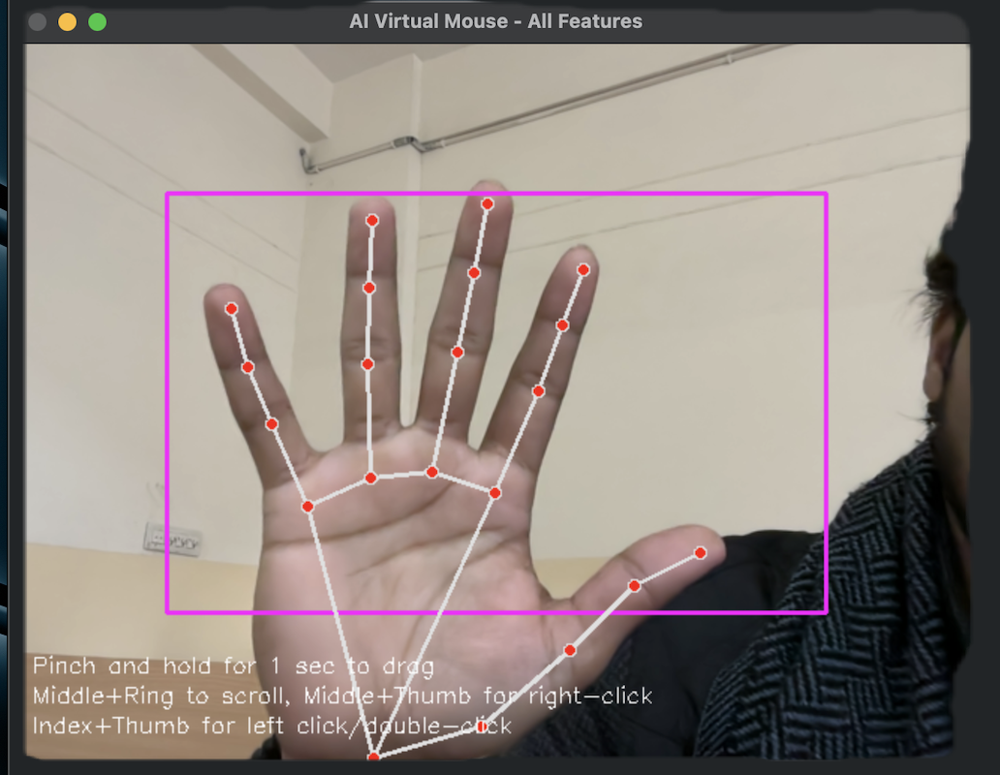

# AI Virtual Mouse

A computer vision-based virtual mouse application that allows you to control your computer cursor using hand gestures captured through your webcam. This project uses MediaPipe for hand tracking and PyAutoGUI for mouse control.


## 🚀 Features

### Core Features
- **Hand Tracking**: Uses MediaPipe's hand detection model to track finger movements
- **Smooth Cursor Control**: Implements smoothing algorithm for fluid cursor movement
- **Gesture-Based Clicking**: Automatically detects finger pinch gestures for clicking
- **Right-Click Support**: Perform right-clicks using middle finger and thumb pinch gesture
- **Scroll Functionality**: Scroll vertically by bringing middle and ring fingers together and moving up/down
- **Drag & Drop**: Hold pinch gesture for 1 second to initiate drag operations
- **Multi-Gesture Recognition**: Advanced gesture recognition supporting multiple simultaneous operations

### New Advanced Features ✨
- **Configuration Management**: YAML-based configuration system for easy customization
- **Configuration GUI**: User-friendly interface to adjust all settings in real-time
- **Gesture Calibration**: Automatic calibration tool to optimize detection for your hand size
- **Pause/Resume**: Make a fist for 2 seconds to pause/resume mouse control
- **Comprehensive Logging**: Detailed logging system for debugging and performance monitoring
- **Error Handling**: Robust error handling with graceful recovery
- **FPS Counter**: Real-time performance monitoring displayed on screen
- **Unit Tests**: Comprehensive test suite for code quality assurance

## 🛠️ How It Works

The AI Virtual Mouse tracks your index finger tip to move the cursor and recognizes clicks when your thumb and index finger come close together. The system maps hand movements within a designated area of the camera frame to your entire screen space.

### Key Components:

1. **Hand Detection**: MediaPipe Hands model detects hand landmarks in real-time
2. **Coordinate Mapping**: Maps hand positions from camera frame to screen coordinates
3. **Smoothing Algorithm**: Reduces cursor jitter for smoother movement
4. **Click Detection**: Measures distance between thumb and index finger to trigger clicks

## 📋 Requirements

- Python 3.7 or higher
- OpenCV (`cv2`)
- MediaPipe
- PyAutoGUI
- NumPy

All required packages are listed in [requirements.txt](requirements.txt).

## 🔧 Installation

1. Clone or download this repository:
   ```bash
   git clone https://github.com/yourusername/ai-virtual-mouse.git
   cd ai-virtual-mouse
   ```

2. Install required packages:
   ```bash
   pip install -r requirements.txt
   ```

## 🎮 Usage

### Quick Start
See [QUICKSTART.md](QUICKSTART.md) for a comprehensive getting started guide.

### First Time Setup

**1. Calibrate Gestures (Recommended)**
```bash
python src/gesture_calibrator.py
```
Follow on-screen instructions to calibrate gesture detection for your hand size.

**2. Configure Settings (Optional)**
```bash
python src/config_gui.py
```
Launch the GUI to adjust sensitivity, thresholds, and visual feedback.

### Running the Application

**Run with all features:**
```bash
python src/combined_ai_mouse.py
```Make a **fist for 2 seconds** to pause/resume the application
8. Press **'q'**

### Individual Feature Scripts
For specific functionality, you can run individual modules:

- **Basic mouse control**: `python src/ai_mouse.py`
- **Right-click demo**: `python src/right_click_feature.py`
- **Scroll demo**: `python src/scroll_feature.py`
- **Drag & drop demo**: `python src/drag_drop_feature.py`
- **All features combined**: `python src/combined_ai_mouse.py`

### Gesture Controls
1. Position your hand within the purple rectangle shown on the camera feed
2. Move your **index finger** (landmark ID 8) to control the cursor
3. Bring your **thumb** (landmark ID 4) and **index finger** together to perform a left click
4. Bring your **thumb** (landmark ID 4) and **middle finger** (landmark ID 12) together for right click
5. Bring your **middle** (ID 12) and **ring finger** (ID 16) together to enter scroll mode, then move hand up/down
6. Pinch and hold **thumb** and **index finger** for 1 second to initiate drag operations
7. Press 'q' to quit the application

## ✋ Hand Gestures

- **Cursor Movement**: Move your index finger (landmark ID 8) within the purple tracking area to move the mouse cursor
- **Left Click**: Touch your thumb (landmark ID 4) to your index finger tip - a green circle will appear as visual feedback
- **Double Click**: Touch your thumb to your index finger tip twice in quick succession (within 0.3 seconds) - a blue circle will appear as visual feedback
- **Right Click**: Touch your thumb (landmark ID 4) to your middle finger tip (landmark ID 12) - a red circle will appear as visual feedback
- **Scroll Mode**: Touch your middle finger (landmark ID 12) to your ring finger (landmark ID 16) to activate scroll mode - a yellow circle will appear as visual feedback
- **Drag & Drop**: Pinch your index finger and thumb and hold for 1 second to initiate drag - a larger blue circle will appear as visual feedback
- **Active Area**: Keep your hand within the purple rectangle for optimal tracking

## ⚙️ Configuration
application uses a YAML configuration file (`config.yaml`) for all settings.

### Using the Configuration GUI

Launch the graphical configuration tool:
```bash
python src/config_gui.py
```

Features:
- Real-time parameter adjustment
- Organized tabs for different settings
- Save/load configurations
- Reset to defaults

### Manual Configuration

Edit `config.yaml` directly to customize:

**Cursor Settings:**
- `smoothening`: Controls cursor smoothness (1-15, default: 5)
- `frame_reduction`: Border area size (50-200, default: 100)

**Click Settings:**
- `left_click_distance`: Pinch threshold for left click (20-50, default: 30)
- `right_click_distance`: Pinch threshold for right click (30-60, default: 40)
- `double_click_time`: Max time between clicks (0.1-0.5s, default: 0.3)

**Scroll Settings:**
- `threshold`: Minimum movement to trigger scroll (10-40, default: 20)
- `sensitivity`: Scroll amount per movement (5-20, default: 10)
- `activation_distance`: Finger distance to activate (20-50, default: 30)

**Other Settings:**
- Camera resolution and device
- Visual feedback options
- Performance monitoring
- Accessibility features

See `config.yaml` for all available options and detailed comments
Adjust these values based
- Make sure your camera is properly connected and not being used by another application
- Try changing the `camera.device_id` in config.yaml (usually 0 or 1)
- Check camera permissions on your system

**Poor tracking performance**: 
- Ensure adequate lighting
- Run the calibration tool: `python src/gesture_calibrator.py`
- Adjust `smoothening` and `frame_reduction` in config.yaml
- Check logs in `logs/ai_mouse.log` for errors

**Gestures not responding**: 
- Run calibration to optimize for your hand size
- Check that your hand is positioned within the purple tracking rectangle
- Ensure fingers are clearly visible to the camera
- Adjust distance thresholds in config.yaml or using the GUI

**Incorrect cursor positioning**: 
- Verify camera resolution settings match your actual camera
- Adjust `frame_reduction` parameter

**Multiple gesture triggers**: 
- Adjust distance thresholds in configuration
- Use calibration tool for optimal settings

**Scroll not working**: 
- Keep middle and ring fingers together while moving vertically
- Adjust `scroll.activation_distance` in config

**Drag & drop not working**: 
- Hold pinch gesture for full duration (default 1 second)
- Check `drag.hold_duration` setting

### Debug Mode

Check application logs for detailed information:
```bash
tail -f logs/ai_mouse.log
```

Logs include:
- Initialization status
- Configuration values
- Performance metrics
- Error messages with stack traces
Here's a demonstration of the AI Virtual Mouse in action:



## ⚠️ Notes

- Ensure good lighting conditions for optimal hand tracking
- The camera should have a clear view of your hand
- Initial calibration might be needed for optimal performance
- The application requires constant camera access

## 🔧 Troubleshooting

### Common Issues:

**Camera not detected**: Make sure your camera is properly connected and not being used by another application.

**Poor tracking performance**: Ensure adequate lighting and adjust the `smoothening` and `frame_reduction` parameters in the configuration.

**Gestures not responding**: Check that your hand is positioned within the purple tracking rectangle and that your fingers are clearly visible to the camera.

**Incorrect cursor positioning**: Verify that the camera resolution settings match your actual camera capabilities.

**Multiple gesture triggers**: Adjust the distance thresholds (`click_distance`, `right_click_distance`) if gestures are being triggered too easily.

**Scroll not working**: Ensure you're keeping middle and ring fingers together while moving vertically to activate scroll mode.

**Drag & drop not working**: Hold the pinch gesture for at least 1 second before moving to initiate drag mode.

## 🤝 Contributing

1. Fork the repository
2. Create a feature branch (`git checkout -b feature/amazing-feature`)
3. Commit your changes (`git commit -m 'Add some amazing feature'`)
4. Push to the branch (`git push origin feature/amazing-feature`)
5. Open a Pull Request

Please make sure to update tests as appropriate and adhere to the code style guidelines.

## 🐛 Issues

If you encounter any bugs or have feature requests, please [open an issue](https://github.com/yourusername/ai-virtual-mouse/issues) with a clear description and reproduction steps.

## 📄 License

This project is licensed under the MIT License - see the [LICENSE](LICENSE) file for details.

## 🙏 Acknowledgments

- MediaPipe for the hand tracking capabilities
- OpenCV for computer vision processing
- PyAutoGUI for mouse control automation
- NumPy for mathematical computations

## 📞 Contact

If you have any questions, feel free to reach out or open an issue in the repository.

## 💰 Support

If this project helped you, consider supporting the development:

[](https://buymeacoffee.com/)
[](https://paypal.me/)

## 🚀 Future Scope

### Future Enhancements & Scalability

**AI Virtual Keyboard**: Integrate a virtual on-screen keyboard that allows users to type by hovering over keys, making the tool a complete hardware replacement for users with physical disabilities.

**Voice Commands Integration**: Add voice control capabilities to complement hand gestures for enhanced accessibility.

**Gesture Customization**: Allow users to define custom gestures for specific actions through a configuration interface.

**Advanced Scrolling**: Implement horizontal scrolling and zoom gestures using multiple finger combinations.

**Machine Learning Enhancement**: Train custom models to recognize user-specific gestures for improved accuracy and personalization.

## 📁 Project Structure
The project is organized as follows:
```
AI VIRTUAL MOUSE/
├── src/                          # Source code files
│   ├── ai_mouse.py               # Basic mouse control with cursor movement and left click
│   ├── right_click_feature.py    # Right-click functionality implementation
│   ├── scroll_feature.py         # Scroll functionality implementation
│   ├── drag_drop_feature.py      # Drag and drop functionality implementation
│   ├── combined_ai_mouse.py      # Complete application with all features integrated
│   └── __init__.py               # Package initialization
├── docs/                         # Documentation files
│   ├── README.md                 # Documentation overview
│   ├── contributing.md           # Contribution guidelines
│   ├── license-details.md        # Detailed license information
│   └── project_structure.md      # Detailed project architecture
├── images/                       # Project images and demos
│   └── demo.png                  # Demo screenshot
├── tests/                        # Test files (future addition)
├── README.md                     # Main project documentation
├── requirements.txt              # Python dependencies
├── setup.py                      # Package setup configuration
├── LICENSE                       # License information
└── .gitignore                    # Git ignore rules
```